# Boğaz Swim Race Analytics 13 Years, 27000+ Swimmer

- **Boğaziçi Kıtalararası Yüzme Yarışı** (Istanbul, 6.500 m) results from 2014 to 2026
- **Çanakkale Boğaz Yüzme Yarışması** (Dardanelles, 5.000 m) results from 2026

---

## Tech stack

- **Python 3** core language for all scripts
- **pandas** data cleaning, merging and aggregation
- **matplotlib and seaborn** all charts
- **scipy.stats** Kruskal-Wallis H test, Pearson and Spearman correlation
- **requests and BeautifulSoup** collection of official race results

---

## 1. Participation Boğaziçi Kıtalararası Yüzme Yarışı 2014-2026

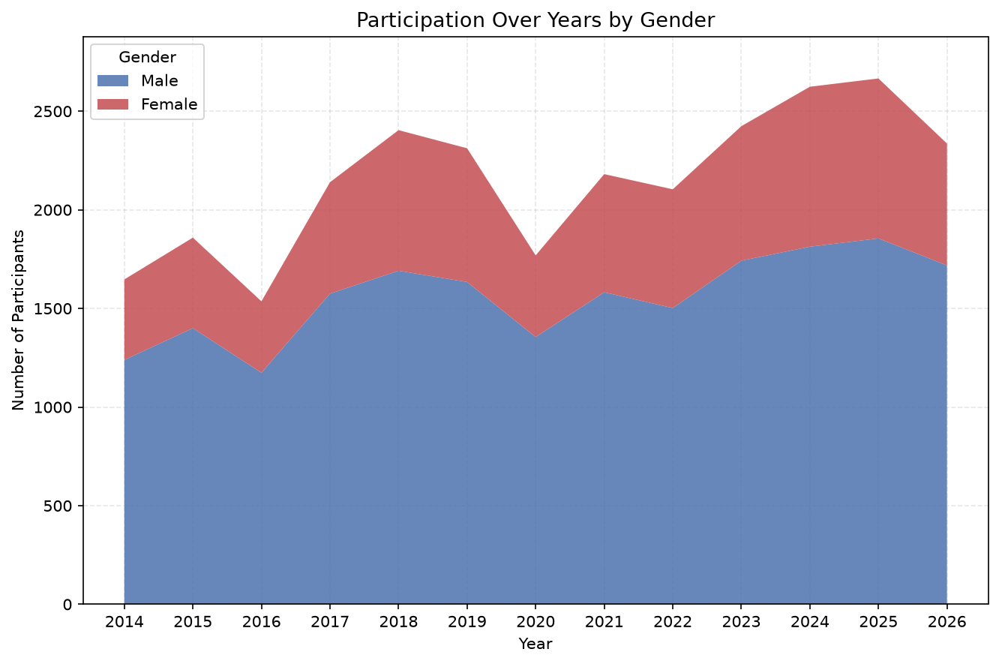

**Findings**

- Total finishers grew from 1647 in 2014 to a peak of 2666 in 2025 rise of about 62%.
- Growth is not steady. 2016 and 2020 show sharp drops. The 2020 drop lines up with the global pandemic.
- 2026 shows a drop from the 2025 peak, down to 2.336 finishers (about -12%).

---

## 2. Overall position vs finish time by sex Boğaziçi Kıtalararası Yüzme Yarışı (2014-2026)

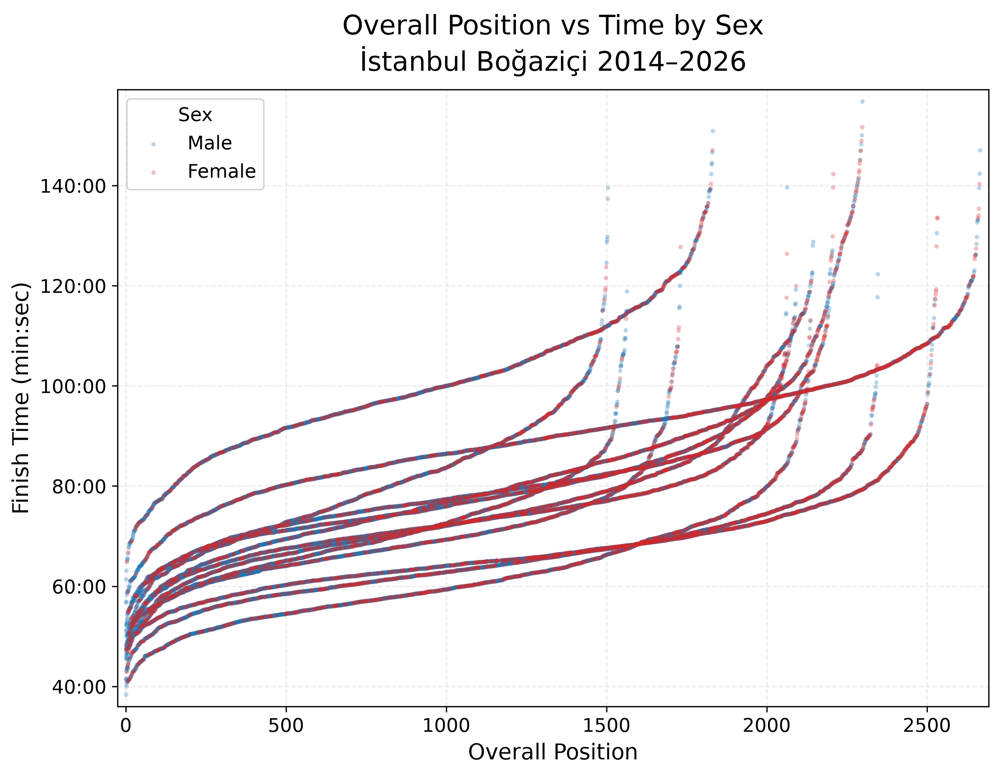

**Findings**

- Each years curve follows similar shape 1) slow rise through the fast group 2) flat middle section then 3) steep rise at the tail.
- Curves with the longest tail (2024, 2025) match the years with the highest total finisher counts.

---

## 3. 2026 cross race comparison: Çanakkale vs Istanbul

### 3.1 Pace relationship between two races

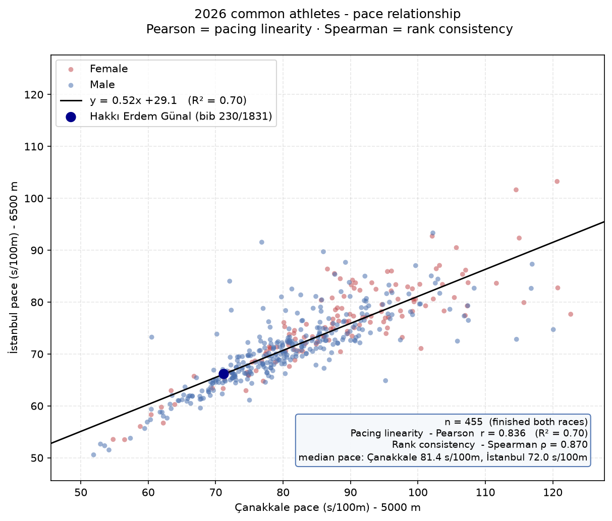

**Findings**

- 455 athletes finished both races in 2026.
- Pace in one race predicts pace in the other: Pearson r = 0.836 (R^2 = 0.70).
- Rank order is even more stable than pace: Spearman $\rho$ = 0.870. A swimmer's place relative to peers carries over between races more reliably than their raw pace.
- Median pace in Çanakkale is 81.4 s/100m. Median pace in Istanbul is 72.0 s/100m. The gap is 9.4 s/100m.
- Istanbul course runs faster for almost every swimmer in the shared group that means much stronger current than the Çanakkale course.

### 3.2 Pace by age group both races

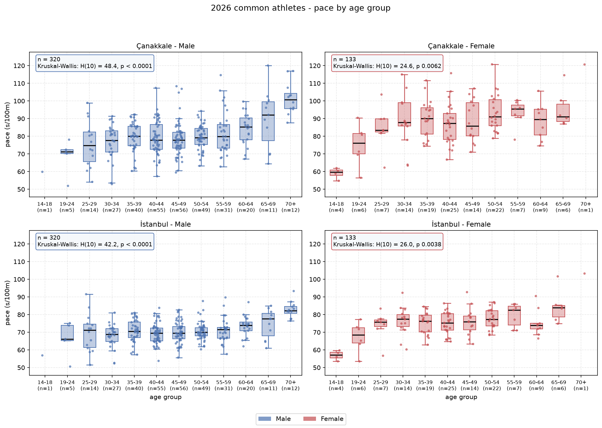

**Findings**

- The Kruskal-Wallis test returns p < 0.01 in all four panels (male/female x Çanakkale/Istanbul). Age group has a real effect on pace in both races.
- The effect is stronger for men (H = 48.4 Çanakkale, H = 42.2 Istanbul) than for women (H = 24.6 Çanakkale, H = 26.0 Istanbul).
- Pace is fastest in the 19–29 age range and slows from the 60+ groups onward in both races.
- Istanbul pace is faster than Çanakkale pace in every age group, matching the overall median gap.

---

## 4. Istanbul 2026 full race breakdown

### 4.1 Finish-time distribution

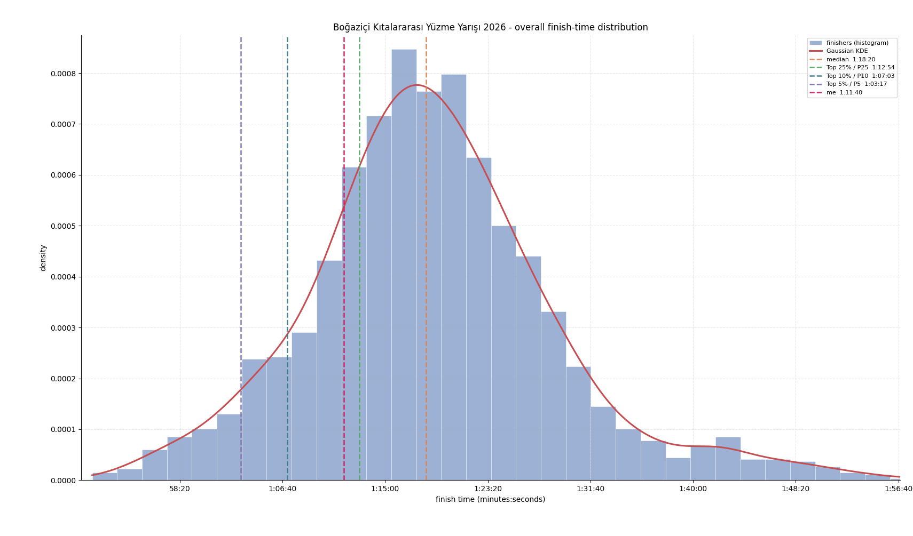

**Findings**

- 2208 finishers. Median time: 1:18:20.
- Top 5% finished under 1:03:17. Top 10% finished under 1:07:03.

### 4.2 Finish time by age band and gender

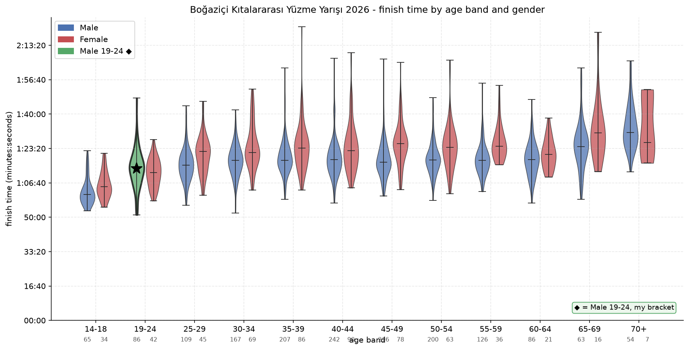

**Findings**

- The 14-18 age band posts the fastest median time for both sexes.

### 4.3 Participation and gender split by nation

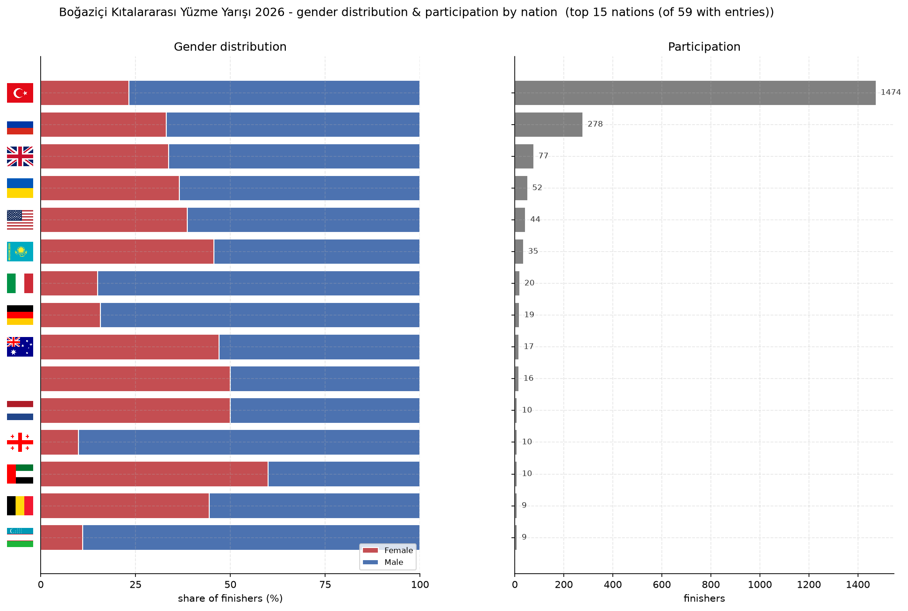

**Findings**

- Türkiye supplies 1474 of 2208 finishers about 67% of the field.
- Russia is the second largest group with 278 finishers then Great Britain, Ukraine and the US.
- Female share by nation varies widely 60% in the UAE, near 50% in the Netherlands and Kazakhstan but under 15% in Georgia and Uzbekistan.

### 4.4 Finish time density, male vs. female

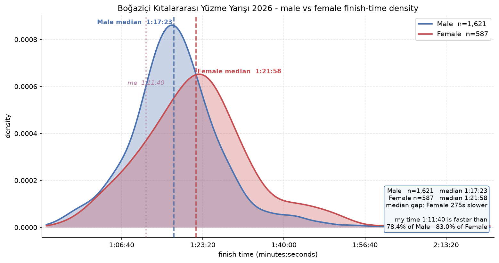

**Findings**

- Male median: 1:17:23 (n = 1,621). Female median: 1:21:58 (n = 587). Gap: 275 seconds.
- The female distribution is wider and more spread to the right than the male distribution, which points to more variation in experience level among female finishers.

---

## 5. Çanakkale 2026 - full race breakdown

### 5.1 Finish-time distribution

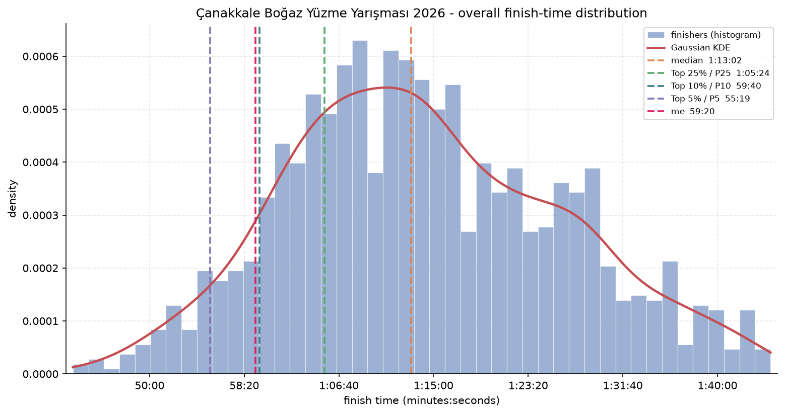

**Findings**

- 1318 finishers. Median time: 1:13:02.
- Top 5% finished under 55:19. Top 10% finished under 59:40.
- The histogram shows two density regions, one near the median and a smaller one near 1:30:00. This points to a mixed field of competitive and recreational swimmers.

### 5.2 Finish time by age band and gender

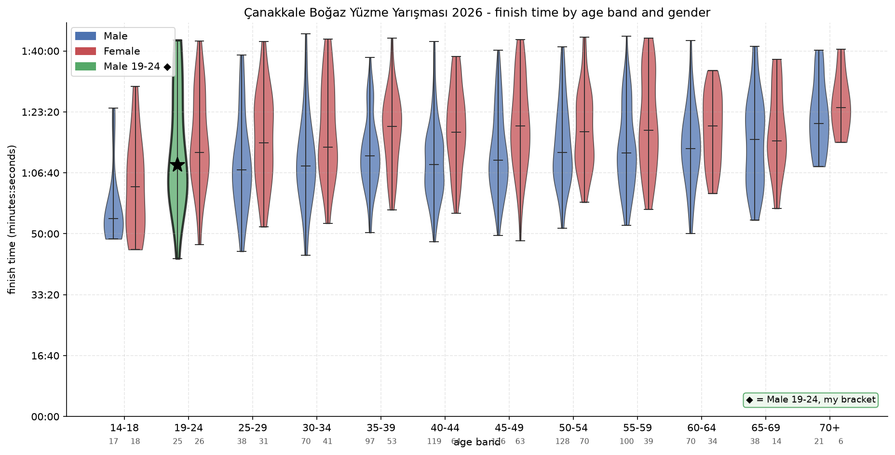

**Findings**

- As in Istanbul the 14–18 age band posts the fastest median for both sexes.
- From the 25–29 band onward, men post a faster median than women with a gap that runs 6 to 9 minutes through most bands.
- In the 65–69 band the female median (1:15:24) is marginally faster than the male median (1:15:44). Sample size is small (F n=14).
- Finish times at age 70+ are faster here than in Istanbul for both sexes — likely a course and distance effect (5000 m vs 6500 m).

### 5.3 Participation and median pace, by nation

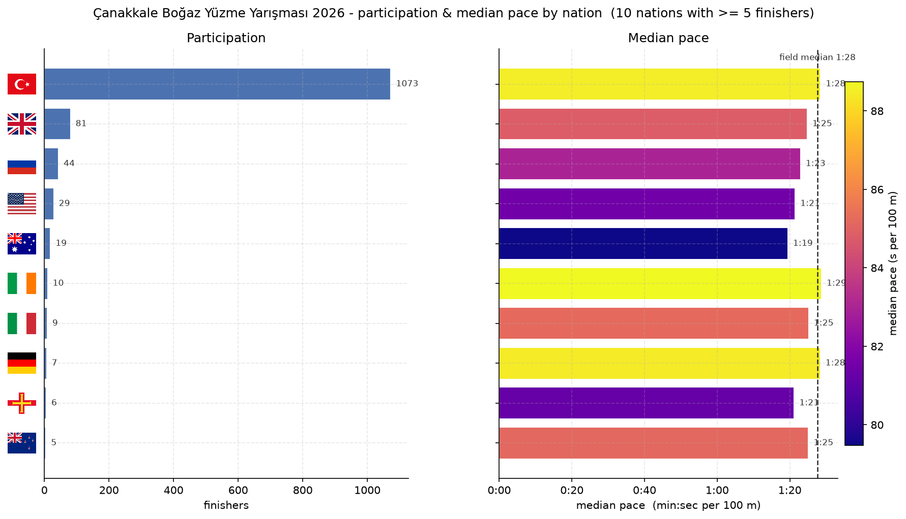

**Findings**

- Türkiye supplies 1073 of 1318 finishers about 81% of the field, a higher local share than Istanbul.
- The field drops off sharply after Türkiye: Great Britain (81), Russia (44), United States (29).
- The fastest median pace by nation belongs to Australia (1:19/100m), ahead of the United States and Guernsey (1:21/100m each).

### 5.4 Finish-time density, male vs. female

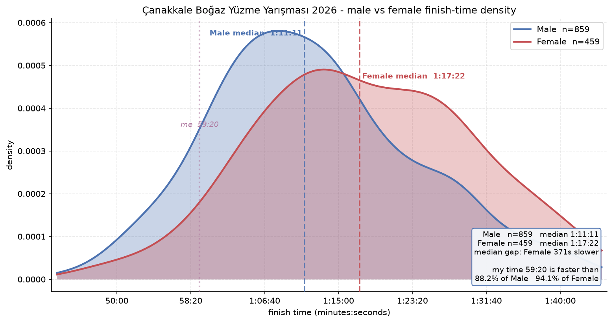

**Findings**

- Male median: 1:11:11 (n = 859). Female median: 1:17:22 (n = 459). Gap: 371 seconds — larger than the 275 second gap in Istanbul.
- The female distribution again runs wider and further right than the male distribution.

---

## Methods notes

- Finish times include only official, valid results (status = FINISHED).
- Gender labels come from official race registration data.
- The Kruskal-Wallis H test checks whether pace distributions differ across age groups. A low p-value (< 0.05) rejects the claim that all groups share the same distribution.
- Pearson r measures the linear fit between two pace series. Spearman ρ measures how well rank order carries over independent of a linear fit.
- Small sub-groups (n < 10) appear in several charts. Treat their medians as indicative, not conclusive.

---

## How to reproduce

```bash
pip install -r requirements.txt
python participation_over_years.py
python overall_position_vs_time.py
python 2026/common_2026_charts.py
python 2026/istanbul/visualize_results.py
python 2026/canakkale/visualize_results.py
```

Each script writes its charts to the matching `output/` folder shown in the repository structure above.